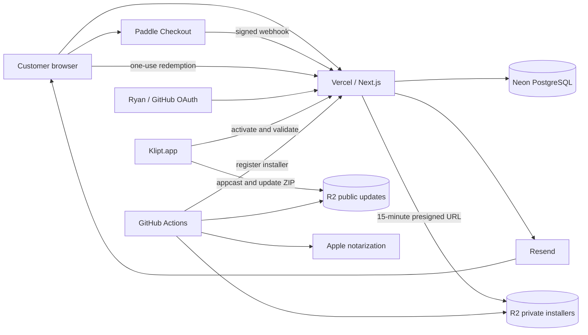
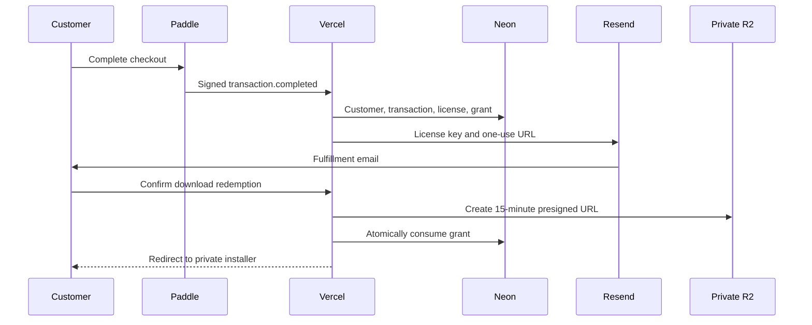

# Klipt Infrastructure

This document is the operational source of truth for Klipt's production
infrastructure. It describes the deployed architecture, provider boundaries,
configuration contract, data flows, release supply chain, recovery procedures,
and known gaps.

Do not put credentials, private keys, connection strings, customer data, or
provider tokens in this file. Secret values live in Vercel, GitHub Actions,
provider dashboards, the operator's password manager, and protected local
backups.

## Current Production State

Status as of July 25, 2026. Repository properties are source-validated;
provider configuration and live-state claims are dated operational facts
verified by the operator in the relevant dashboards and production services.
Recheck those facts after provider-side changes.

| Area                 | State                                                  |
| -------------------- | ------------------------------------------------------ |
| Source repository    | `Ryan-Milton/klipt`, public GitHub repository          |
| Production branch    | `main`                                                 |
| Canonical site       | `https://www.klipt.dev`                                |
| Apex site            | `https://klipt.dev`, redirects to `www`                |
| Web host             | Vercel                                                 |
| DNS                  | Cloudflare authoritative DNS                           |
| Database             | Neon PostgreSQL with Drizzle migrations through `0005` |
| Payments             | Paddle Billing, shared account with Knosys             |
| Private installers   | Cloudflare R2, `klipt-installers`                      |
| Public updates       | Cloudflare R2, `klipt-updates` at `updates.klipt.dev`  |
| Transactional email  | Resend                                                 |
| Web analytics        | PostHog Product Analytics, cookieless configuration    |
| Admin authentication | Auth.js with GitHub OAuth                              |
| Native signing       | Apple Developer ID Application, team `A8S73HH5G6`      |
| Native notarization  | Apple notary service through App Store Connect API     |
| Native updates       | Sparkle 2 with EdDSA-signed update archives            |
| Release automation   | Manual GitHub Actions workflow                         |
| First native release | Not published yet                                      |

Production database migrations `0004` and `0005` were applied before the
first purchase. The production release registry currently has no current
artifact, so checkout must not be promoted until the first signed release is
registered.

## System Context



## Infrastructure Inventory

| Provider or component | Responsibility                                         | Source of truth                               |
| --------------------- | ------------------------------------------------------ | --------------------------------------------- |
| GitHub                | Source, CI, release automation, release credentials    | Repository and Actions settings               |
| Vercel                | Next.js hosting, API functions, production environment | Vercel project settings                       |
| Cloudflare DNS        | Authoritative DNS for `klipt.dev`                      | Cloudflare zone                               |
| Cloudflare R2         | Private DMGs, public Sparkle ZIPs and appcast          | R2 buckets                                    |
| Neon                  | Commerce, licensing, release, and audit data           | PostgreSQL and Drizzle migrations             |
| Paddle                | Checkout, transaction truth, refunds, disputes         | Paddle dashboard and signed webhooks          |
| Resend                | Fulfillment and account-link email                     | Resend project and DNS records                |
| PostHog               | Explicit cookieless website events                     | PostHog project                               |
| GitHub OAuth          | Admin identity                                         | GitHub OAuth application                      |
| Apple Developer       | Developer ID certificate and Team ID                   | Apple Developer portal and Keychain           |
| App Store Connect     | Notarization API key                                   | Users and Access, Integrations                |
| Sparkle               | Native update verification                             | Embedded public key and backed-up private key |

The project does not currently use Terraform, Pulumi, Wrangler, Vercel CLI
configuration, or any other infrastructure-as-code system. Provider dashboard
state must therefore be kept synchronized with this document manually.

## Domains and DNS

### Hostnames

| Hostname            | Purpose                                             | Destination                    |
| ------------------- | --------------------------------------------------- | ------------------------------ |
| `www.klipt.dev`     | Canonical storefront, APIs, OAuth, native licensing | Vercel production              |
| `klipt.dev`         | Apex and email domain                               | Vercel redirect to `www`       |
| `updates.klipt.dev` | Sparkle appcast and immutable update ZIPs           | Public R2 bucket               |
| `support@klipt.dev` | Support replies and Resend sender                   | Resend plus mailbox/forwarding |

### DNS Ownership

Cloudflare is authoritative for the zone. The registrar delegates to
Cloudflare nameservers. Vercel continues to host the web application.

Expected website records:

| Type  | Name  | Target                 | Proxy mode |
| ----- | ----- | ---------------------- | ---------- |
| A     | `@`   | `76.76.21.21`          | DNS only   |
| CNAME | `www` | `cname.vercel-dns.com` | DNS only   |

Cloudflare R2 manages the DNS record for `updates.klipt.dev`. Resend SPF, DKIM,
and return-path records remain DNS only. CAA records permit the certificate
authorities required by Vercel and Cloudflare.

### Domain Invariants

- `klipt.dev` must return a permanent redirect to `www.klipt.dev`.
- `www.klipt.dev` must serve the Vercel production deployment from `main`.
- `updates.klipt.dev` must never point to the private installer bucket.
- Paddle webhook and GitHub OAuth callback URLs use `www.klipt.dev` directly.
- Native activation and release-registration requests use `www.klipt.dev`
  directly rather than relying on redirects.
- TLS must remain valid for all three HTTP hostnames.

The redirect is configured in Vercel, not in repository code. Verify it after
domain or Vercel configuration changes.

## Vercel and the Web Application

### Project Model

- Framework: Next.js 16 App Router.
- Package manager: pnpm 10.22.0.
- Node.js: 22 in CI; Vercel must use a compatible supported runtime.
- Root directory: repository root, `./`.
- Production source: `main`.
- Production URL: `https://www.klipt.dev`.
- API routes use the Node.js runtime, not Edge runtime.
- Provider configuration is validated when each service is invoked, allowing
  builds to run without live credentials.

Vercel automatically creates previews for pull requests. Preview environments
must not use production Paddle webhooks or production signing/release secrets.

### Security Headers

`next.config.ts` configures:

- `X-Content-Type-Options: nosniff`
- `X-Frame-Options: DENY`
- `Referrer-Policy: strict-origin-when-cross-origin`
- Camera, microphone, and geolocation disabled

Vercel supplies HSTS on the production domains. There is currently no
application Content Security Policy.

### Public Routes

| Route                                       | Purpose                                   |
| ------------------------------------------- | ----------------------------------------- |
| `/`                                         | Storefront and Paddle checkout            |
| `/buy`                                      | Redirect to the pricing section           |
| `/checkout/success`                         | Informational post-checkout page          |
| `/account`                                  | Request customer account link             |
| `/account/[token]`                          | Confirm account-link redemption           |
| `/account/details`                          | Short-lived customer account view         |
| `/download/[token]`                         | Confirm one-use installer redemption      |
| `/download`                                 | Invalid, consumed, or storage-error state |
| `/admin`                                    | Private operations console                |
| `/privacy`, `/terms`, `/refund`, `/license` | Legal pages                               |
| `/support`                                  | Support contact and instructions          |
| `/changelog`                                | Release history                           |
| `/robots.txt`, `/sitemap.xml`               | Search metadata                           |

The checkout success page is not a fulfillment source of truth. Only a signed
Paddle completion webhook creates an entitlement.

### API Routes

| Method and route                   | Boundary                        | Responsibility                 |
| ---------------------------------- | ------------------------------- | ------------------------------ |
| `POST /api/paddle/webhook`         | Paddle HMAC                     | Process commerce events        |
| `POST /api/licenses/activate`      | High-entropy license key        | First-Mac activation           |
| `POST /api/licenses/validate`      | License and installation ID     | Periodic validation            |
| `POST /api/download/redeem`        | One-use token, same-origin form | Return presigned installer URL |
| `POST /api/account/request`        | Public generic response         | Send account link              |
| `POST /api/account/redeem`         | One-use token, same-origin form | Create customer session        |
| `GET/POST /api/auth/[...nextauth]` | Auth.js                         | GitHub OAuth                   |
| `POST /api/admin/action`           | Admin session and origin check  | Operator actions               |
| `POST /api/admin/releases`         | Bearer token                    | Verify and register installer  |

There is no dedicated health endpoint, queue worker, cron job, global rate
limiter, or automated webhook recovery worker.

## Neon PostgreSQL

### Connection

- Vercel uses the pooled production `DATABASE_URL`.
- The application uses `@neondatabase/serverless` and Drizzle's Neon HTTP
  driver.
- A process-global client is initialized lazily.
- The application credential has direct table access; row-level security is
  not used.
- Local and production migrations are executed with `pnpm db:migrate`.

### Tables

| Table                  | Responsibility                                           |
| ---------------------- | -------------------------------------------------------- |
| `customers`            | Normalized email and Paddle customer ID                  |
| `transactions`         | Paddle transaction and ordered payment state             |
| `licenses`             | Encrypted license, hash, and ordered entitlement state   |
| `activations`          | One-Mac installation claim and validation metadata       |
| `release_artifacts`    | Immutable installer metadata and current release pointer |
| `download_grants`      | Encrypted/hashed one-use installer token                 |
| `customer_magic_links` | Hashed 15-minute account tokens                          |
| `webhook_events`       | Sanitized Paddle event, lease, attempts, and errors      |
| `email_deliveries`     | Resend request audit                                     |
| `admin_notes`          | Internal support notes                                   |
| `admin_audit`          | Attempted admin mutations                                |

### State Enums

| Enum                 | Values                              |
| -------------------- | ----------------------------------- |
| `license_status`     | `active`, `refunded`, `revoked`     |
| `transaction_status` | `completed`, `refunded`, `disputed` |
| `webhook_status`     | `pending`, `processed`, `failed`    |
| `email_status`       | `pending`, `sent`, `failed`         |

### Important Constraints

- Paddle transaction IDs are unique.
- A transaction produces at most one license.
- A license has at most one activation.
- A license has at most one download grant.
- Release version/build pairs are unique.
- A partial unique index allows only one current release artifact.
- Provider event IDs are unique and provide webhook deduplication.

### Migrations

| Migration                  | Purpose                                 |
| -------------------------- | --------------------------------------- |
| `0000_damp_sunfire`        | Initial schema                          |
| `0001_silent_frank_castle` | Installation UUID model adjustment      |
| `0002_happy_prowler`       | Unique release version/build            |
| `0003_early_starfox`       | Recoverable encrypted download token    |
| `0004_crazy_maelstrom`     | Transaction status occurrence timestamp |
| `0005_clear_lake`          | License status occurrence timestamp     |

Migrations `0004` and `0005` were applied to production while transaction and
license tables were empty. Future non-null migrations must use an
expand/backfill/contract rollout so old and new application versions can run
concurrently during a Vercel deployment.

### Backup Policy

Neon point-in-time recovery, retention period, and restore testing are provider
settings and are not configured in code. Required operating policy:

1. Keep Neon PITR enabled for the longest practical production retention.
2. Test restoration to a separate Neon branch before relying on a backup.
3. Keep database backups separate from `LICENSE_ENCRYPTION_KEY` backups.
4. Verify restored encrypted licenses and download tokens can be decrypted.
5. Never restore directly over production without consistency checks.

## Paddle Commerce

### Account Model

Klipt and Knosys share one Paddle account but use separate products and prices.
Paddle customer directories, reporting, seller identity, and selected webhook
event streams are account-wide.

Klipt's entitlement classifier requires both:

1. `custom_data.product === "klipt_macos_lifetime"`
2. An item whose price ID equals server-side `PADDLE_PRICE_ID`

Both signals must agree. A marker/price mismatch fails and retries rather than
silently issuing or discarding an entitlement.

Every checkout or payment-link integration that can sell Klipt must attach the
exact product marker. A price alone is intentionally insufficient.

### Product and Price

- Product: Klipt.
- Billing: one-time purchase.
- Base price: US$5.
- License: one Mac.
- Updates: lifetime.
- Refund policy: 14 days.
- Paddle handles local currency conversion.
- No purchasing-power price overrides.

The browser and server price IDs must be identical:

- `NEXT_PUBLIC_PADDLE_PRICE_ID`
- `PADDLE_PRICE_ID`

### API Permissions

The Paddle API key requires only:

- Customers: Read
- Transactions: Read

No Paddle write permission is required by Klipt.

### Webhook

Production destination:

```text
https://www.klipt.dev/api/paddle/webhook
```

Subscribed event families include transaction completion, adjustments,
refunds, disputes, chargebacks, and reversals. In the current Paddle event
catalog, `transaction.completed`, `adjustment.created`, and
`adjustment.updated` cover the required flow.

Security and retry behavior:

- Raw body HMAC-SHA256 validation.
- Five-minute signature timestamp tolerance.
- Constant-time signature comparison.
- Unique Paddle event ID deduplication.
- Ten-second Paddle customer/transaction API timeout.
- Failed events can be claimed immediately.
- Pending events become reclaimable after ten minutes.
- Claim ownership prevents stale workers from overwriting newer results.
- Unsupported or foreign events are acknowledged as ignored.

Foreign completed transactions are rejected before database insertion. Foreign
adjustment events may be stored in sanitized form and marked processed after a
Paddle transaction lookup confirms they do not belong to Klipt.

### Fulfillment



Fulfillment requires a current `release_artifacts` row. Without one, the
webhook remains failed and must be retried after the first release is
registered.

### Refund and Dispute Semantics

- Refunds are terminal and dominate dispute state.
- Disputes cannot overwrite a refunded transaction/license.
- Disputes and reversals use Paddle `occurred_at`, not delivery order.
- Reversal-before-dispute and dispute-before-reversal result in the same final
  state.
- A reversal cannot clear a manual administrator revocation.
- Native clients observe changed status on their next successful validation.
- A Mac that stays offline may retain its previously active cache indefinitely.

## Cloudflare R2

### Buckets

| Bucket             | Visibility           | Writers        | Readers          | Contents               |
| ------------------ | -------------------- | -------------- | ---------------- | ---------------------- |
| `klipt-installers` | Private              | GitHub Actions | Vercel presigner | Notarized DMGs         |
| `klipt-updates`    | Public custom domain | GitHub Actions | Sparkle clients  | ZIPs and `appcast.xml` |

### Credential Separation

Vercel uses a read-only R2 S3 credential restricted to
`klipt-installers`. GitHub Actions uses a separate read/write credential
restricted to both Klipt buckets.

Never put the GitHub write credential in Vercel. Never make
`klipt-installers` public as an incident workaround.

### Object Layout

Private bucket:

```text
releases/Klipt-{version}-{build}.dmg
```

Public update bucket:

```text
Klipt-{version}-{build}.zip
appcast.xml
```

Versioned DMG and ZIP object names are intended to be immutable. The release
workflow performs a collision preflight before its overwrite-capable upload,
but R2 object lock and versioning do not enforce this policy. `appcast.xml` is
the only intentionally mutable release object.

### Private Download Semantics

- Download tokens are stored as SHA-256 hashes and recoverable AES-GCM
  ciphertext.
- Redemption is POST-only to reduce email-scanner consumption.
- Presigned URLs expire after 15 minutes.
- Only one concurrent redemption can consume the grant.
- The resulting R2 URL remains reusable until its 15-minute expiration.
- A used grant cannot be reissued under current product policy.

Release registration compares the expected private object size and
uploader-supplied SHA-256 metadata through `HeadObject` before making an
artifact current. It does not download and independently hash the object.

R2 versioning, object lock, replication, and lifecycle policies are not
currently documented or managed in code.

## Resend

Resend sends:

- Fulfillment email with license and installer link.
- Customer account-link email.
- Admin-triggered unused-grant reissue email.

Production sender:

```text
Klipt <support@klipt.dev>
```

SPF and DKIM records live in Cloudflare DNS. Replies must reach a monitored
mailbox or forwarding destination.

Each API attempt creates an `email_deliveries` row. `sent` means Resend
accepted the request; Klipt does not currently ingest Resend delivery, bounce,
or complaint webhooks.

Fulfillment uses a stable license-based Resend idempotency key. Account-link
mail is protected by a 15-minute database suppression window and a PostgreSQL
advisory lock, but there is no IP rate limiter.

## PostHog

PostHog is optional at build time and enabled in production through the public
project token.

Privacy configuration:

- Memory-only persistence.
- No cookies.
- No autocapture.
- No automatic page-leave capture.
- No session recording.
- No person profiles.
- No native analytics.
- Tokenized account/download paths normalized before capture.

Explicitly emitted events:

- `page_viewed`
- `checkout_started`

`support_opened` is reserved in the client event type but is not currently
emitted.

PostHog is not an error-monitoring or infrastructure-monitoring system.

## Authentication and Administration

### GitHub OAuth

OAuth callback:

```text
https://www.klipt.dev/api/auth/callback/github
```

Auth.js uses:

- GitHub `read:user` scope.
- JWT sessions.
- Eight-hour maximum session age.
- Secure, HttpOnly, SameSite Lax production cookie.
- Numeric GitHub provider ID allow-listing.

Only `ADMIN_GITHUB_USER_ID` can sign in. The current operator is Ryan Milton,
GitHub numeric ID `42124719`.

The allow list is checked during sign-in, not on every authenticated request.
Changing `ADMIN_GITHUB_USER_ID` does not immediately revoke an existing JWT;
wait for the eight-hour session maximum or rotate `AUTH_SECRET` when immediate
revocation is required.

### Admin Console

The admin console shows recent licenses, transactions, activations, download
grants, webhooks, email attempts, notes, and audit rows. It can:

- Add internal notes.
- Revoke a license manually with a reason.
- Restore only an eligible manual revocation.
- Reissue an unused installer grant and email.
- Retry a failed webhook through an atomic processing claim.

Admin audit rows record that an action was attempted. They do not currently
record a separate success/failure outcome.

### Customer Sessions

Customer account access does not use Auth.js. A one-use 15-minute email token
creates a signed 15-minute customer cookie scoped to `/account`. The account
view masks the email and license key but displays the transaction ID, purchase
date, device details, and installer-grant status.

## Native macOS Application

### Build Identity

| Setting           | Value                                |
| ----------------- | ------------------------------------ |
| Bundle ID         | `com.ryanmilton.Klipt`               |
| Team ID           | `A8S73HH5G6`                         |
| Version/build     | `1.0.0 (1)` for first release        |
| Deployment target | macOS 26.0 or newer                  |
| Architectures     | Apple Silicon, arm64 only            |
| Signing           | Developer ID Application             |
| Runtime           | Hardened runtime                     |
| Sandbox           | Disabled                             |
| App mode          | Menu-bar application (`LSUIElement`) |

### Local Data

- Clipboard history and snippets are AES-GCM encrypted locally.
- A random encryption key lives in the user's Keychain.
- Installation UUID and full license key use separate, this-device-only
  Keychain items.
- The local clipboard encryption key uses after-first-unlock accessibility but
  is not currently marked this-device-only.
- No clipboard data is sent to Klipt infrastructure.

### Activation

The activation request contains:

- License key.
- Random installation UUID.
- Device model and user-facing nickname.
- App version and build.

One unique activation is allowed per license. Repeating activation from the
same installation is idempotent. Another installation receives a device-limit
response. There is no customer-facing deactivation or transfer workflow.

### Validation and Outages

- Validation becomes due every 24 hours.
- The app periodically checks whether validation is due.
- Network/server/storage errors preserve a previously active license as
  offline-active.
- Refunded and revoked terminal states remain blocked during an outage.
- Fresh activation and uncached startup fail closed.
- Capture, paste, and snippet assignment are license-gated.
- Existing history remains readable and deletable while blocked.

The offline-active state has no maximum expiration. This favors local
availability over immediate revocation enforcement.

## Apple Signing and Notarization

### Assets

| Asset                                            | Storage                                         |
| ------------------------------------------------ | ----------------------------------------------- |
| Developer ID Application certificate/private key | macOS Keychain and protected `.p12` backup      |
| `.p12` password                                  | Password manager and GitHub secret              |
| App Store Connect `.p8` key                      | Protected backup and GitHub secret              |
| App Store Connect Key ID and Issuer ID           | Password manager and GitHub secrets             |
| Sparkle private key                              | macOS Keychain, protected backup, GitHub secret |
| Sparkle public key                               | GitHub variable and embedded build setting      |

Protected local backups currently live under `~/Documents/Klipt/` with mode
`0600`. They must also be backed up outside the Mac in a secure password
manager or encrypted vault.

### Notarization Flow

1. Import the Developer ID `.p12` into a temporary CI keychain.
2. Resolve Sparkle and verify private/public key correspondence.
3. Archive and export an arm64 Release build.
4. Verify the embedded Sparkle public key and code signature.
5. Submit an app ZIP to Apple notarization.
6. Staple and validate the exported app.
7. Create the Sparkle update ZIP from the stapled app.
8. Create the DMG.
9. Submit, staple, and validate the DMG.
10. Run Gatekeeper assessments against both app and DMG.

## Sparkle Updates

- Sparkle version is locked in `Package.resolved`.
- Feed URL: `https://updates.klipt.dev/appcast.xml`.
- Each update ZIP is signed with the Sparkle EdDSA private key.
- The app embeds the matching public key.
- The appcast enclosure contains version, build, size, URL, and EdDSA
  signature.
- Minimum system version is macOS 26.0.
- Hardware requirement is arm64.
- ZIPs are immutable and cached for one year.
- `appcast.xml` is uploaded with `no-cache`.

Loss of the Sparkle private key prevents trusted updates to installed copies.
Changing only the public-key variable would strand existing installations.

## GitHub Actions

### Web CI

`.github/workflows/web-ci.yml` runs on relevant pull requests and pushes to
`main`:

1. Frozen pnpm install.
2. Prettier check.
3. ESLint.
4. TypeScript typecheck.
5. Vitest.
6. Next.js production build.

Web CI does not run database migrations or deploy Vercel directly. Vercel's
Git integration handles deployment.

### Native CI

`.github/workflows/native-ci.yml` runs on native and release-supply-chain
changes:

1. Native test suite on a macOS 26 runner.
2. Unsigned arm64 Release build.

### Release Workflow

`.github/workflows/release.yml` is manual and accepts:

- Semantic version in `x.y.z` form.
- Monotonically increasing numeric build.

It uses the GitHub `production` environment and a non-canceling concurrency
group. It rejects non-`main` refs, runs the native test suite, signs and
notarizes the app, uploads artifacts, registers the current installer, signs
and verifies the Sparkle appcast, and creates a public GitHub Release containing
release notes only. The paid DMG remains private in R2.

The release workflow does not rerun the web CI suite. The intended commit must
already have passed the required pull-request and post-merge checks on `main`.

### Sandbox Acceptance Workflow

`.github/workflows/release-sandbox.yml` creates a signed and notarized DMG for
the isolated acceptance environment described in `docs/sandbox-pipeline.md`.
It runs only from `main`, compiles the native licensing URL as
`https://sandbox.klipt.dev/api/licenses/`, uploads only to the private sandbox
installer bucket, and registers only with the sandbox web application. It does
not publish a GitHub Release or modify the production appcast. Its embedded
Sparkle feed uses the sandbox hostname so it cannot update into a production
build.

Production and sandbox builds use the same source and bundle ID. Both release
workflows verify the licensing URL embedded in the exported app before upload.
Sandbox commerce, database, encryption, release-token, and R2 credentials must
remain separate from production.

### Repository Variables

| Variable                | Purpose                          |
| ----------------------- | -------------------------------- |
| `SPARKLE_PUBLIC_ED_KEY` | Embedded update-verification key |
| `R2_PRIVATE_BUCKET`     | Private DMG bucket               |
| `R2_UPDATES_BUCKET`     | Public Sparkle bucket            |

### Repository Secrets

| Secret                       | Purpose                             |
| ---------------------------- | ----------------------------------- |
| `BUILD_CERTIFICATE_BASE64`   | Base64 Developer ID `.p12`          |
| `P12_PASSWORD`               | `.p12` export password              |
| `KEYCHAIN_PASSWORD`          | Temporary CI keychain password      |
| `ASC_KEY_BASE64`             | Base64 App Store Connect `.p8`      |
| `ASC_KEY_ID`                 | App Store Connect API key ID        |
| `ASC_ISSUER_ID`              | App Store Connect issuer UUID       |
| `SPARKLE_PRIVATE_KEY_BASE64` | Base64 exported Sparkle private key |
| `R2_ACCOUNT_ID`              | Cloudflare account ID               |
| `R2_ACCESS_KEY_ID`           | GitHub R2 write credential          |
| `R2_SECRET_ACCESS_KEY`       | GitHub R2 write credential secret   |
| `RELEASE_PUBLISH_TOKEN`      | Bearer token shared with Vercel     |

All required variables and secrets were present during the first-release
preflight. GitHub never exposes secret values after creation.

## Vercel Environment Contract

### Public Build-Time Variables

These values are intentionally visible in browser JavaScript:

| Variable                          | Purpose                          |
| --------------------------------- | -------------------------------- |
| `NEXT_PUBLIC_APP_URL`             | Canonical app and email-link URL |
| `NEXT_PUBLIC_POSTHOG_KEY`         | Public PostHog project token     |
| `NEXT_PUBLIC_POSTHOG_HOST`        | PostHog ingest host              |
| `NEXT_PUBLIC_PADDLE_CLIENT_TOKEN` | Public Paddle client token       |
| `NEXT_PUBLIC_PADDLE_PRICE_ID`     | Checkout price                   |
| `NEXT_PUBLIC_PADDLE_ENVIRONMENT`  | `sandbox` or `production`        |

Production `NEXT_PUBLIC_APP_URL` must be `https://www.klipt.dev`. Public
variables require a Vercel redeployment when changed.

### Server-Side Configuration and Secrets

| Variable                  | Purpose                           |
| ------------------------- | --------------------------------- |
| `DATABASE_URL`            | Neon pooled PostgreSQL URL        |
| `LICENSE_ENCRYPTION_KEY`  | Base64 32-byte AES key            |
| `PADDLE_API_KEY`          | Paddle customer/transaction reads |
| `PADDLE_WEBHOOK_SECRET`   | Webhook signing secret            |
| `PADDLE_PRICE_ID`         | Server-side Klipt price           |
| `PADDLE_API_BASE`         | Paddle API environment            |
| `R2_ACCOUNT_ID`           | Cloudflare account ID             |
| `R2_ACCESS_KEY_ID`        | Vercel read-only R2 credential    |
| `R2_SECRET_ACCESS_KEY`    | Vercel read-only R2 secret        |
| `R2_BUCKET`               | Private installer bucket          |
| `RESEND_API_KEY`          | Resend credential                 |
| `EMAIL_FROM`              | Verified sender                   |
| `AUTH_SECRET`             | Auth.js signing secret            |
| `AUTH_GITHUB_ID`          | GitHub OAuth client ID            |
| `AUTH_GITHUB_SECRET`      | GitHub OAuth client secret        |
| `ADMIN_GITHUB_USER_ID`    | Numeric administrator ID          |
| `RELEASE_PUBLISH_TOKEN`   | Release registration bearer token |
| `CUSTOMER_SESSION_SECRET` | Customer session HMAC secret      |

`RELEASE_PUBLISH_TOKEN` must match in Vercel and GitHub Actions.

## Security Boundaries

### Public by Design

- PostHog project token.
- Paddle client token.
- Paddle price ID.
- Sparkle public key.
- Public update ZIPs and appcast.
- GitHub source repository.

### Secret

- Database URL.
- License encryption key.
- Paddle API and webhook secrets.
- R2 S3 secret keys.
- Resend API key.
- OAuth and Auth.js secrets.
- Customer-session secret.
- Release-publish token.
- Apple `.p12`, `.p8`, and passwords.
- Sparkle private key.

### Key Separation

- Vercel R2 credentials are read-only and private-bucket scoped.
- GitHub R2 credentials are write-capable and limited to the two Klipt
  buckets.
- Browser Paddle token is separate from server Paddle API key.
- Paddle webhook secret is separate from Paddle API authentication.
- Native installation ID, license key, and local encryption key use separate
  Keychain items.

## Critical Backups and Rotation

### License Encryption Key

`LICENSE_ENCRYPTION_KEY` encrypts both license keys and recoverable unused
download tokens. Loss means existing encrypted values cannot be recovered.

Rotation requires a planned migration that decrypts and re-encrypts both:

- `licenses.encrypted_key`
- `download_grants.encrypted_token`

Do not rotate this value directly in Vercel.

### Sparkle Key

Keep at least two independent protected copies of the Sparkle private key. A
normal secret rotation is not possible because installed apps trust the
embedded public key.

### Other Secret Rotation

| Secret                    | Effect of rotation                                 |
| ------------------------- | -------------------------------------------------- |
| `AUTH_SECRET`             | Invalidates admin sessions                         |
| `CUSTOMER_SESSION_SECRET` | Invalidates short-lived customer sessions          |
| `PADDLE_API_KEY`          | Update Vercel and redeploy before revoking old key |
| `PADDLE_WEBHOOK_SECRET`   | Coordinate destination and Vercel deployment       |
| `R2` credentials          | Overlap old/new credentials during rollout         |
| `RELEASE_PUBLISH_TOKEN`   | Update Vercel and GitHub together                  |
| App Store Connect key     | Update GitHub key file, ID, and issuer if needed   |
| Developer ID `.p12`       | Export new cert/key and update GitHub secrets      |

## Deployment Runbooks

### Web Deployment

1. Open a pull request against `main`.
2. Require Web CI, Native CI when applicable, and Vercel preview success.
3. Review database compatibility before merging schema changes.
4. Apply backward-compatible migrations in the documented rollout order.
5. Merge to `main`.
6. Wait for Vercel production deployment and post-merge CI.
7. Verify apex redirect, canonical home, admin route, robots, sitemap, and API
   signature rejection.
8. Watch Vercel logs and Paddle deliveries after commerce changes.

### Database Migration

1. Generate with `pnpm db:generate`.
2. Review generated SQL and snapshots.
3. Test against a Neon development or restored branch.
4. Confirm rolling compatibility with the currently deployed application.
5. Back up or confirm PITR before destructive changes.
6. Run `pnpm db:migrate` against production.
7. Verify schema and application behavior.

Never assume a generated `NOT NULL` migration is safe for populated tables.

### First and Subsequent Native Release

Preconditions:

- Intended commit is on `main`.
- All CI is green.
- GitHub production variables and secrets exist.
- Developer ID certificate is valid.
- App Store Connect key is valid.
- Sparkle public/private keys match.
- R2 custom domain is active.
- Release registration endpoint is healthy.
- Version/build objects do not already exist.

Workflow:

1. Dispatch `Release Klipt` against `main`; the workflow rejects any other ref.
2. Enter semantic version and increasing build number.
3. Monitor test, certificate import, archive, and notarization.
4. Verify both app and DMG stapling/Gatekeeper assessment.
5. Verify private DMG object metadata.
6. Verify public update ZIP.
7. Verify one current Neon release artifact.
8. Verify appcast XML, version/build, URL, size, and signature.
9. Install the DMG on a clean supported Mac.
10. Test activation, capture, paste, and Sparkle update behavior.

### Failed Paddle Fulfillment

1. Locate the event in Paddle.
2. Inspect `/admin` webhook status and `last_error`.
3. Inspect whether customer, transaction, license, grant, and email rows already
   exist.
4. Correct the root cause.
5. Retry a failed webhook in admin or replay it from Paddle.
6. For a stale pending event, wait ten minutes before replaying.
7. Confirm exactly one license and grant, a processed event, and Resend
   acceptance.

Do not delete webhook rows to force a retry.

### Shared Paddle Classification Failure

For `inconsistent Klipt product metadata`:

1. Compare browser and server Paddle price IDs.
2. Confirm checkout supplied `klipt_macos_lifetime`.
3. Confirm Paddle event items contain the configured Klipt price.
4. Confirm the API key has Transactions: Read.
5. Correct configuration and replay the event.

### Missing Email

1. Inspect `email_deliveries` and Resend logs.
2. If webhook processing failed, retry the webhook.
3. If the download grant remains unused, use admin reissue/email.
4. If the grant is consumed, follow the no-recovery product policy.
5. Verify SPF, DKIM, mailbox, and Resend account status.

### Private Download Failure

- Presigning failure should leave the grant unused.
- Concurrent redemption permits one winner only.
- A consumed grant cannot be restored by the application.
- Verify object existence, bucket name, account ID, and Vercel read-only key.
- Do not expose the private bucket publicly.

### License Incident

- Manual revocation requires a reason.
- Manual restore is permitted only for eligible manual revocations.
- Refunded licenses cannot be manually restored.
- Paddle dispute reversals cannot clear manual revocations.
- There is no activation transfer/reset operation.
- Server outage preserves existing active offline installations but blocks new
  activation.

### Neon Restore

1. Restore into a separate Neon branch/database.
2. Verify migration journal and schema columns.
3. Verify transaction/license/grant/activation consistency.
4. Verify exactly one current release artifact.
5. Confirm encrypted values decrypt using the retained key.
6. Test through a Vercel preview.
7. Switch production only after consistency checks.

## Partial Release Recovery

The release workflow is intentionally collision-resistant but is not fully
restartable after upload:

- Existing DMG or ZIP objects fail collision checks.
- The private installer may become current before appcast publication.
- A draft, notes-only GitHub Release may already exist.
- The public appcast may still reference the previous build.

Do not overwrite immutable version/build objects. Inspect which steps succeeded,
then either complete publication using the exact existing artifacts and
signatures or issue a new build number. There is no automated current-installer
rollback endpoint.

## Monitoring and Alerts

No infrastructure alerting is committed. Production operations should add:

- Vercel 5xx, function-duration, and latency alerts.
- Paddle webhook delivery/retry alerts.
- Queries for failed webhooks and pending leases older than ten minutes.
- Queries for failed email deliveries.
- Neon storage, connection, and PITR monitoring.
- `updates.klipt.dev/appcast.xml` availability and XML validation.
- R2 custom-domain and expected-object checks.
- Resend bounce and complaint monitoring.
- DNS and TLS monitoring.
- GitHub release-workflow failure notifications.

PostHog does not replace any of these controls.

## Known Gaps and Launch Risks

### Installer Privacy Depends on Release Workflow Policy

The repository and GitHub Releases are public. The workflow intentionally
publishes release notes without attaching the paid DMG. The private DMG must
remain available only through `klipt-installers` presigned URLs. Treat any
future GitHub Release asset change as a security-boundary change.

### No Automated Health or Recovery Workers

There is no health endpoint, webhook sweeper, email retry worker, rate limiter,
or automated data-retention process.

### Resend Delivery State Is Incomplete

Klipt records Resend API acceptance but does not receive delivered, bounced, or
complained webhooks.

### Offline Revocation Delay

A previously active native installation can remain offline-active indefinitely.
Refund and revocation enforcement therefore requires eventual connectivity.

### No Infrastructure as Code

DNS, Vercel settings, R2 policies, provider permissions, OAuth configuration,
and monitoring are dashboard-managed. Drift must be checked manually.

### Privacy Copy Must Match Recoverable Tokens

Download grants have both a hash and encrypted recoverable token to support
idempotent fulfillment. Privacy/legal copy must not claim that those tokens are
stored only as hashes.

## Change Control

Update this document whenever any of the following changes:

- Provider or account ownership.
- Domain, DNS, or canonical host.
- Environment-variable contract.
- Paddle product, price, marker, permissions, or event subscriptions.
- Database schema or migration procedure.
- R2 bucket names, domains, or credential scopes.
- Authentication allow list or OAuth callback.
- Signing, notarization, or Sparkle keys.
- CI, deployment, or release workflow.
- Backup, retention, recovery, monitoring, or incident policy.

Infrastructure changes must be reviewed with the same rigor as application
code, even when the provider-side portion cannot be represented in Git.
